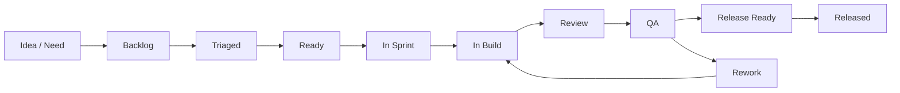

# SiteTrack Agile Workflow

## Purpose

This workflow explains how SiteTrack work moves from idea to release. It is designed for a small product team using AI agents for drafting, building, QA support, and documentation. The language should stay clear and Telugu-friendly: simple English, direct status, and no hidden assumptions.

## End-To-End Agile Flow

| Step | Input | Activity | Output | Owner |
| --- | --- | --- | --- | --- |
| 1. Capture | Customer need, site team pain point, bug, or improvement idea. | Add item to backlog with role, problem, and expected value. | Backlog item. | Product Owner |
| 2. Triage | New backlog item. | Check urgency, affected roles, dependencies, and risk. | Priority and initial owner. | Product Owner + Tech Lead |
| 3. Route & Shape | Prioritized item. | Team Lead Agent assigns the right specialist; Product Manager Agent writes story, acceptance criteria, UX notes, and test notes. | Ready candidate. | Team Lead Agent + Product Manager Agent + Product Owner |
| 4. Ready Review | Ready candidate. | Confirm Definition of Ready, dependencies, and release value. | Sprint-ready story. | Product Owner + Team |
| 5. Sprint Planning | Sprint-ready stories. | Select work based on capacity and risk. | Sprint backlog. | Scrum Master / Product Owner |
| 6. Build | Approved story. | Implement in small changes; keep docs updated when behavior changes. | Pull request / change set. | Engineer + Build Agent |
| 7. Review | Change set. | Review scope, code, UX, role access, and docs. | Approved or rework needed. | Tech Lead + Reviewer |
| 8. QA | Approved change. | Run functional, role, regression, mobile, and release checks. | QA result and defects. | QA Lead + QA/Test Agent |
| 9. Release | QA-passed increment. | Build, smoke test, deploy, monitor, and communicate. | Release note and live version. | Release Manager |
| 10. Learn | Released increment. | Review usage, defects, decisions, and backlog changes. | Retro actions and updated backlog. | Full team |

## Story Lifecycle



## Definition Of Ready

A story is Ready only when:

- User role is clear: Architect, PM, Contractor, Client, Admin, or all.
- Problem statement is written in business language.
- Acceptance criteria are testable.
- UI copy or data labels are clear enough for site users.
- Role permission impact is explicitly stated.
- Data storage impact is known: localStorage, future backend, export, or no data.
- Dependencies and blockers are listed.
- QA notes include happy path, negative path, mobile, and role access checks.
- Release risk is understood.
- No open decision is blocking implementation.

### Ready Story Template

```md
## User Story
As a [role], I want [capability], so that [business value].

## Acceptance Criteria
- Given [context], when [action], then [result].

## Notes
Roles affected:
Data affected:
Mobile/PWA impact:
Compliance impact:
Dependencies:
```

## Definition Of Done

A story is Done only when:

- Approved acceptance criteria pass.
- No unrelated code or documentation changes are included.
- Role access is checked for affected roles.
- Mobile layout is checked for key screen sizes.
- Offline/PWA behavior is checked when relevant.
- Export/report behavior is checked when relevant.
- Existing critical flows still work.
- User-facing text is clear and consistent.
- Documentation is updated when behavior, workflow, release process, or decisions change.
- QA status is recorded.
- Product Owner accepts the completed behavior.

## Sprint Cadence

Recommended cadence: 2-week sprint.

| Ceremony | Duration | Purpose | Output |
| --- | --- | --- | --- |
| Backlog Refinement | 45-60 minutes weekly | Clarify upcoming work, split large stories, add acceptance criteria. | Ready candidates. |
| Sprint Planning | 60-90 minutes | Select sprint goal and stories based on capacity. | Sprint backlog and owner list. |
| Daily Standup | 10-15 minutes | Share progress, blockers, and same-day focus. | Updated board and blocker actions. |
| Mid-Sprint Quality Check | 30 minutes | Review QA risk, unfinished stories, and scope creep. | Risk actions and scope corrections. |
| Sprint Review | 45-60 minutes | Demo completed work to stakeholders. | Accepted work and feedback. |
| Retrospective | 30-45 minutes | Improve team process and agent usage. | 1-3 action items. |

## Daily Status Format

Use a simple format:

```md
Yesterday:
Today:
Blocked:
Need decision:
```

Example: "Invoice GST validation pending undi because acceptance criteria need PO confirmation."

## Handoff Rules

Handoffs happen at story boundaries and role boundaries:

- Product to Build: include story, acceptance criteria, mock or screen notes, and open decisions.
- Build to Review: include changed paths, behavior summary, risk areas, and local checks.
- Review to QA: include test focus, known gaps, and role access notes.
- QA to Release: include pass/fail summary, unresolved defects, release risk, and rollback notes.
- Release to Product: include release version, feature summary, defects fixed, and monitoring notes.

No handoff is complete without a clear next owner.

## Board Columns

- Backlog
- Triaged
- Ready
- Sprint Selected
- In Build
- In Review
- In QA
- Release Ready
- Released
- Blocked

## Decision Log

Record product and technical decisions here. Keep entries short and dated.

| Date | Decision | Owner | Reason | Impact |
| --- | --- | --- | --- | --- |
| 2026-05-21 | Use docs under `docs/` as the source for Agile and agent workflow documentation. | Documentation Agent | Keeps process docs separate from app code. | Easier review and ownership. |
| 2026-05-21 | Treat agent outputs as drafts until human reviewed. | Product Owner / Tech Lead | Agents can miss business and compliance context. | Reduces release and compliance risk. |
| 2026-05-21 | Keep initial workflow optimized for 2-week sprints. | Product Owner | Fits a small team and allows frequent feedback. | Predictable planning and review rhythm. |
| 2026-05-21 | QA must check role access for every affected feature. | QA Lead | SiteTrack has distinct Architect, PM, Contractor, and Client permissions. | Prevents accidental permission changes. |
| 2026-05-22 | Add business model, pricing, and 50-feature traceability as product planning sources. | Product Manager Agent / Documentation Agent | User wants SiteTrack converted into a sellable SaaS with competitor gap tracking. | Backlog and sprint choices can now reference paid-pilot goals. |
| 2026-05-22 | Drawing releases use one current revision per title/type for PM, Contractor, Client, and share views. | Construction Domain Analyst Agent / Tech Lead | Reduces risk of field teams using superseded drawings. | Architect keeps history; non-architect users see current drawings only when explicitly released to their role. |
| 2026-05-22 | Free static deployment remains demo/pilot only until backend auth/storage/audit are built. | Security & Permissions Agent / DevOps Agent | localStorage is not production-grade multi-user storage. | Sales demos are allowed; production SaaS claims are blocked. |

## Change Control

Use change control when work affects:

- Role access or client visibility.
- Invoices, GST/TDS, RA bills, labor register, or payment data.
- Drawing release and revision rules.
- Safety incidents or compliance-sensitive workflows.
- Data persistence, export format, or future backend schema.
- Release process, deployment, or rollback.

For these items, mark the story as "Decision needed" until the right owner approves.

## Retrospective Questions

- What helped the team deliver value?
- Where did agents save time?
- Where did agent output need too much correction?
- Which bugs escaped our QA checks?
- What should be added to Definition of Ready or Done?
- Which backlog item needs clearer business language?
